## DDD / Painless Rails

What we could use to improve our code

---

## Content

@ul

- Semantic model naming
- Top-level Controllers
- Bounded Context Controllers
- Nested Controllers
- ApplicationControllers

@ulend

---

## Semantic model naming
```ruby
class Shop < ActiveRecord
end

class Sale < ActiveRecord
end
```

---

## Semantic model naming
```ruby
class Partner::Shop < ActiveRecord
end

class Partner::Sale < ActiveRecord
end
```

---

## Semantic model naming

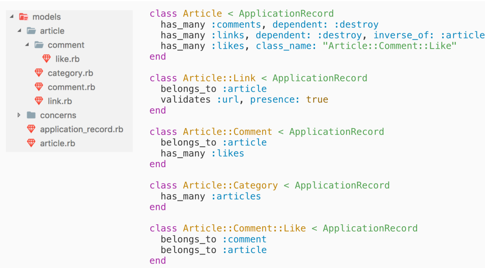

---
## Top-level Controllers
---

@snap[north-west span-33]
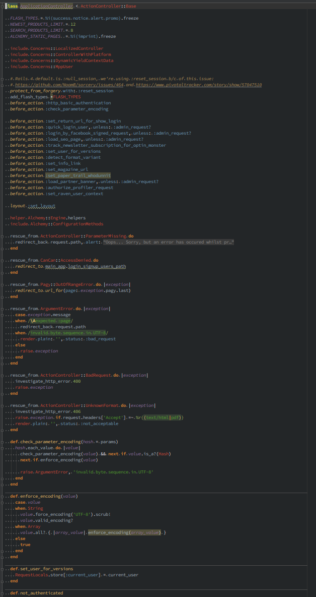
@snapend
@snap[north span-33]
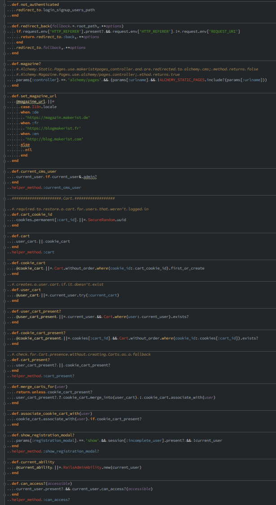
@snapend
@snap[north-east span-33]
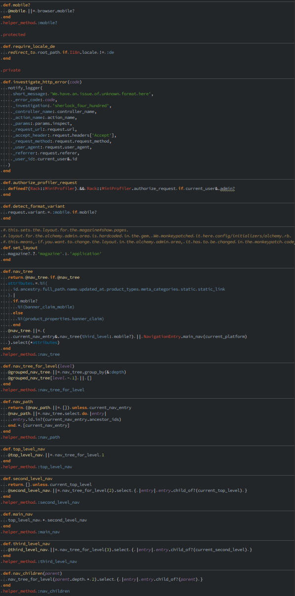
@snapend

---

@snap[north-west span-33]
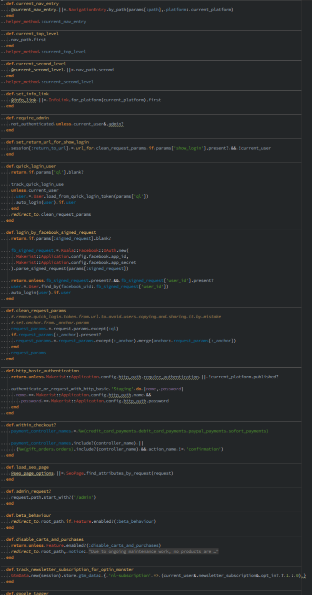
@snapend
@snap[north span-33]
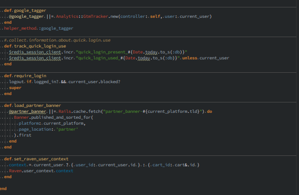
@snapend

---
## Top-level Controllers

@ol
- based on a way of usage
- one base controller per namespace
- api
- feeds
- web
- report
@olend

---
## Bounded Context Controllers

```ruby
resource :products

namespace :marketing do
  resource :products
end

namespace :warehouse do
  resource :products
end

namespace :support do
  resource :products
end
```
---
## Nested Controllers

Problem:

@ul
- view for all posts
- view for posts of specific user
@ulend

@ul
- `PostsController#index`
- `PostsController#index_all`
- `PostsController#user_index`
@ulend

@ul
- `PostsController#index`
- `Users::PostsController#index`
@ulend

---
```ruby
resources :posts, only: [:index, :show]
resources :users, only: [:show] do
  scope module: :users do
    resources :posts, only: [:index]
  end
end
```
---

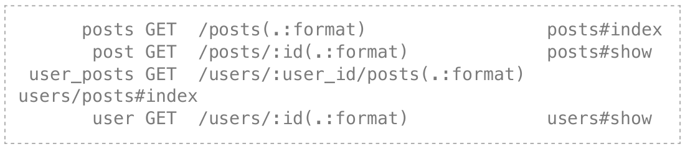
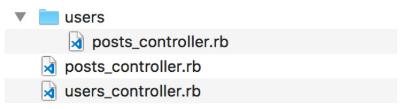

---

```ruby
scope module: :web do
  namespace :moderation do
    resources :articles, only: [:index, :edit, :update, :show] do
      member do
        patch :publish
      end
    end
  end
  resources :articles do
    member do
      patch :moderate
    end
    scope module: :articles do
      resources :comments do
        scope module: :comments do
          resources :likes, only: [:create]
        end
      end
    end
  end
end
```
---
## 3 Strategies Combined
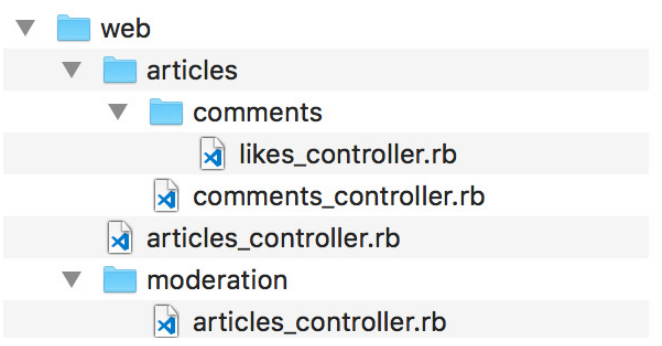
---
## Multiple ApplicationControllers

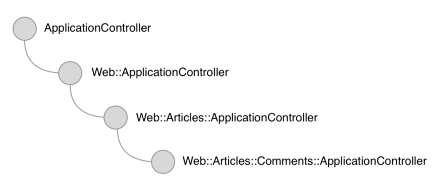
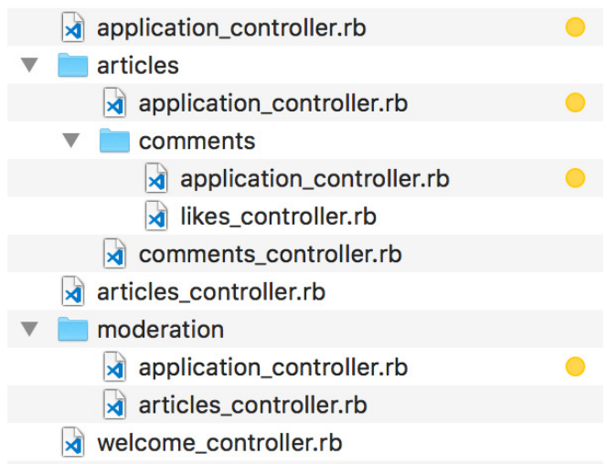

---
# The End
